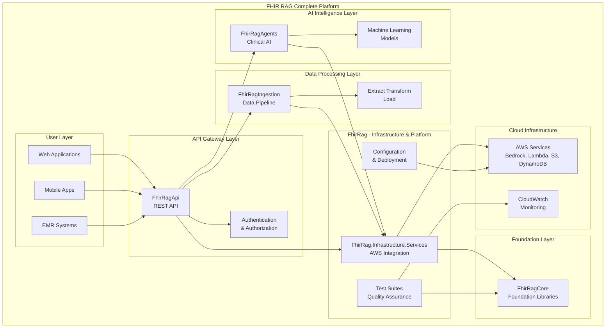

# FHIR RAG - Complete Healthcare Intelligence Platform

## 🎯 Solution Overview

The **FhirRag** solution serves as the comprehensive, production-ready healthcare intelligence platform that combines all FHIR RAG components into a unified system. This solution includes infrastructure services, comprehensive testing suites, and the main configuration for deploying the complete FHIR RAG ecosystem in healthcare environments.

## 🏗️ System Architecture



## 📦 Solution Components

### FhirRag.Infrastructure.Services
**Cloud infrastructure and service integration layer**

- **Purpose**: Centralized AWS service integration and infrastructure management
- **Key Services**:
  - AWS Bedrock LLM integration
  - Lambda orchestration services  
  - Vector embedding services
  - Storage services (S3 + DynamoDB)
  - Service collection extensions for DI

### Comprehensive Test Suites
**Enterprise-grade testing and quality assurance**

- **FhirRag.Core.Tests**: Core domain model and business logic testing
- **FhirRag.Core.Security.Tests**: Security and multi-tenant isolation testing
- **FhirRag.Core.Telemetry.Tests**: Monitoring and analytics testing
- **Purpose**: Ensure system reliability, security, and performance across all components

### Production Configuration
**Deployment and configuration management**

- **Infrastructure as Code**: CloudFormation and Terraform templates
- **Environment Configurations**: Development, staging, and production settings
- **CI/CD Pipelines**: GitHub Actions workflows for automated deployment
- **Monitoring Setup**: CloudWatch, Application Insights integration

## 🌐 Complete System Integration

This solution represents the **complete FHIR RAG platform** that integrates:

1. **FhirRagCore**: Foundation libraries for security, telemetry, and domain models
2. **FhirRagIngestion**: Data processing pipeline for FHIR resource ingestion
3. **FhirRagAgents**: AI-powered clinical decision support and insights
4. **FhirRagApi**: REST API layer for external system integration
5. **Infrastructure Services**: Cloud-native AWS service integrations

## 🔄 Dependencies

### Internal Solution Dependencies
- **FhirRagCore**: Foundation libraries (security, telemetry, abstractions)
- **FhirRagApi**: For API integration testing
- **FhirRagAgents**: For AI service integration
- **FhirRagIngestion**: For data pipeline integration

### External Dependencies
- **AWS SDK**: Complete AWS service integration
- **HL7 FHIR .NET SDK**: FHIR R4 compliance
- **ASP.NET Core**: Web application framework
- **Entity Framework Core**: Data access layer
- **Polly**: Resilience and retry policies

### Cloud Infrastructure
- **AWS Bedrock**: AI/ML model hosting
- **AWS Lambda**: Serverless computing
- **Amazon S3**: Object storage
- **Amazon DynamoDB**: NoSQL database
- **Amazon CloudWatch**: Monitoring and logging
- **AWS IAM**: Identity and access management

## 🚀 Deployment Guide

### Prerequisites
- **AWS Account** with appropriate permissions
- **.NET 9.0 SDK**
- **AWS CLI** configured
- **Docker** (for containerized deployments)
- **Terraform** or **AWS CDK** (for infrastructure as code)

### Complete Platform Deployment

#### 1. Infrastructure Setup
```bash
# Clone repository
git clone https://github.com/your-org/fhir-rag.git
cd fhir-rag/solutions/FhirRag

# Deploy AWS infrastructure
cd infrastructure/
terraform init
terraform plan -var="environment=production"
terraform apply
```

#### 2. Application Deployment
```bash
# Build all solutions
./scripts/build-all.sh

# Deploy ingestion pipeline
cd ../FhirRagIngestion
dotnet lambda deploy-serverless --template serverless.template

# Deploy AI agents
cd ../FhirRagAgents  
dotnet lambda deploy-serverless --template serverless.template

# Deploy API
cd ../FhirRagApi
docker build -t fhir-rag-api .
aws ecs update-service --cluster fhir-rag --service fhir-rag-api
```

#### 3. Configuration and Testing
```bash
# Run system integration tests
cd solutions/FhirRag
dotnet test --configuration Release --filter Category=Integration

# Verify health endpoints
curl https://api.fhir-rag.yourdomain.com/health
curl https://agents.fhir-rag.yourdomain.com/health
```

## ⚙️ Platform Configuration

### Complete System Configuration
```json
{
  "FhirRag": {
    "Environment": "Production",
    "TenantConfiguration": {
      "MultiTenantMode": true,
      "DefaultTenant": "system",
      "TenantValidation": true
    },
    "Infrastructure": {
      "Region": "us-east-1",
      "S3Bucket": "fhir-rag-platform-data",
      "DynamoDbPrefix": "FhirRag-Prod",
      "LambdaTimeout": 900
    },
    "Security": {
      "EncryptionAtRest": true,
      "EncryptionInTransit": true,
      "AuditLogging": true,
      "ComplianceMode": "HIPAA"
    },
    "Monitoring": {
      "EnableDetailedMetrics": true,
      "LogLevel": "Information",
      "RetentionDays": 90,
      "AlertingEnabled": true
    }
  }
}
```

### Environment Variables
```bash
# Platform Configuration
FHIR_RAG_ENVIRONMENT=Production
FHIR_RAG_PLATFORM_VERSION=1.0.0
FHIR_RAG_TENANT_MODE=Multi

# AWS Configuration  
AWS_REGION=us-east-1
AWS_ACCOUNT_ID=123456789012
FHIR_RAG_S3_BUCKET=fhir-rag-platform-data
FHIR_RAG_DYNAMODB_PREFIX=FhirRag-Prod

# Security
FHIR_RAG_ENCRYPTION_KEY=your-platform-encryption-key
FHIR_RAG_JWT_SECRET=your-platform-jwt-secret
ENABLE_AUDIT_LOGGING=true

# Monitoring
CLOUDWATCH_LOG_GROUP=/aws/fhir-rag/platform
APPLICATION_INSIGHTS_KEY=your-insights-key
ENABLE_DETAILED_TELEMETRY=true
```

## 🧪 Enterprise Testing Strategy

### Comprehensive Test Coverage
```bash
# Run complete test suite
dotnet test solutions/FhirRag.sln --configuration Release

# Security testing
dotnet test --filter Category=Security --configuration Release

# Performance testing  
dotnet test --filter Category=Performance --configuration Release

# Integration testing
dotnet test --filter Category=Integration --configuration Release

# Generate coverage reports
dotnet test --collect:"XPlat Code Coverage" --results-directory ./TestResults/
reportgenerator -reports:TestResults/**/coverage.cobertura.xml -targetdir:coverage
```

### Quality Gates
- **Unit Test Coverage**: > 90%
- **Integration Test Coverage**: > 85%
- **Security Test Coverage**: > 95%
- **Performance Benchmarks**: All tests must pass
- **FHIR Compliance**: 100% R4 specification adherence

## 🔒 Enterprise Security & Compliance

### HIPAA Compliance Features
- **Data Encryption**: AES-256 encryption at rest and TLS 1.3 in transit
- **Access Controls**: Role-based access with multi-factor authentication
- **Audit Logging**: Comprehensive audit trails for all data access
- **Data Retention**: Configurable retention policies with secure deletion
- **Backup & Recovery**: Encrypted backups with point-in-time recovery

### Multi-Tenant Security
```csharp
// Platform-level tenant isolation
public class PlatformSecurityMiddleware
{
    public async Task InvokeAsync(HttpContext context, RequestDelegate next)
    {
        var tenantId = ExtractTenantId(context);
        
        if (!await ValidateTenantAccessAsync(tenantId))
        {
            context.Response.StatusCode = 403;
            return;
        }
        
        // Set tenant context for downstream services
        context.Items["TenantId"] = tenantId;
        context.Items["SecurityContext"] = await BuildSecurityContextAsync(tenantId);
        
        await next(context);
    }
}
```

## 📊 Production Monitoring & Operations

### Key Performance Indicators (KPIs)
- **System Uptime**: 99.9% availability target
- **Response Times**: 
  - API queries: < 200ms (95th percentile)
  - AI insights: < 5 seconds (95th percentile)
  - Data ingestion: < 1 minute per 1000 resources
- **Throughput**: 
  - 10,000+ API requests per minute
  - 1 million+ FHIR resources processed per hour
  - 100+ concurrent AI queries

### Operational Dashboards
```yaml
# CloudWatch Dashboard Configuration
FhirRagPlatformDashboard:
  Widgets:
    - SystemHealth:
        Metrics: [ErrorRate, Latency, Throughput]
        Period: 300
    - AIPerformance:
        Metrics: [AIResponseTime, ConfidenceScores, AccuracyRates]
        Period: 300
    - DataProcessing:
        Metrics: [IngestionRate, ProcessingErrors, QueueDepth]
        Period: 60
    - Security:
        Metrics: [AuthFailures, UnauthorizedAccess, AuditEvents]
        Period: 300
```

### Alerting and Incident Response
```bash
# Critical alerts
- API error rate > 5%
- AI agent unavailability > 1 minute
- Data ingestion lag > 10 minutes
- Security breach detection
- Performance degradation > 20%

# Alert channels
- PagerDuty for critical issues
- Slack for warnings
- Email for informational alerts
- SMS for security incidents
```

## 🔧 Platform Administration

### Administrative Tasks
```bash
# Platform health check
curl https://platform.fhir-rag.com/health/detailed

# Tenant management
fhir-rag-cli tenant create --name "Hospital-A" --plan "Enterprise"
fhir-rag-cli tenant list
fhir-rag-cli tenant backup --tenant-id "hospital-a"

# Performance optimization
fhir-rag-cli performance analyze --timeframe "24h"
fhir-rag-cli cache warm --tenant-id "hospital-a"

# Security auditing
fhir-rag-cli audit export --tenant-id "hospital-a" --days 30
fhir-rag-cli security scan --full-system
```

### Scaling Operations
```bash
# Auto-scaling configuration
aws application-autoscaling register-scalable-target \
  --service-namespace ecs \
  --scalable-dimension ecs:service:DesiredCount \
  --resource-id service/fhir-rag/api \
  --min-capacity 3 \
  --max-capacity 50

# Lambda concurrency management
aws lambda put-provisioned-concurrency-config \
  --function-name FhirRag-Agents-BedrockAgent \
  --provisioned-concurrency-config AllocatedProvisionedConcurrencyFromPool=100
```

## 🚨 Troubleshooting & Support

### Common Platform Issues

1. **Cross-Service Communication Failures**
   ```bash
   # Check service mesh connectivity
   kubectl get services -n fhir-rag
   aws ecs describe-services --cluster fhir-rag
   ```

2. **Performance Degradation**
   ```bash
   # Monitor resource utilization
   aws cloudwatch get-metric-statistics \
     --namespace AWS/ECS \
     --metric-name CPUUtilization \
     --dimensions Name=ServiceName,Value=fhir-rag-api
   ```

3. **Data Consistency Issues**
   ```bash
   # Validate data integrity
   fhir-rag-cli data validate --tenant-id "hospital-a"
   fhir-rag-cli data repair --dry-run --tenant-id "hospital-a"
   ```

### Support Channels
- **Emergency**: security@fhir-rag.com (24/7)
- **Technical Support**: support@fhir-rag.com
- **Documentation**: https://docs.fhir-rag.com
- **Community**: https://community.fhir-rag.com

## 📈 Scalability & Growth

### Horizontal Scaling
- **API Layer**: Auto-scaling groups with load balancers
- **AI Agents**: Lambda concurrency with provisioned capacity
- **Data Processing**: SQS-based queue scaling
- **Storage**: S3 with CloudFront CDN distribution

### Vertical Scaling
- **Compute Resources**: Instance type optimization
- **Database Performance**: DynamoDB auto-scaling
- **Memory Management**: Application-level caching
- **Network Optimization**: VPC peering and dedicated connections

## 🎯 Use Cases & Implementation

### Healthcare Organization Deployment
```yaml
# Example: Large Hospital System
OrganizationType: Hospital System
PatientVolume: 500,000+ patients
DataVolume: 10TB+ clinical data
Integrations: Epic, Cerner, Allscripts
Compliance: HIPAA, SOC2, ISO 27001
Deployment: Multi-region AWS
```

### Integration Examples
```csharp
// Complete platform initialization
public class FhirRagPlatformStartup
{
    public void ConfigureServices(IServiceCollection services)
    {
        // Register all FHIR RAG services
        services.AddFhirRagCore(Configuration);
        services.AddFhirRagSecurity(Configuration);
        services.AddFhirRagTelemetry(Configuration);
        services.AddFhirRagInfrastructure(Configuration);
        services.AddFhirRagAgents(Configuration);
        services.AddFhirRagApi(Configuration);
        
        // Platform-wide configuration
        services.Configure<PlatformOptions>(Configuration.GetSection("FhirRag"));
    }
}
```

---

**🏥 The Complete Healthcare Intelligence Platform - Secure, Scalable, Compliant, AI-Powered**